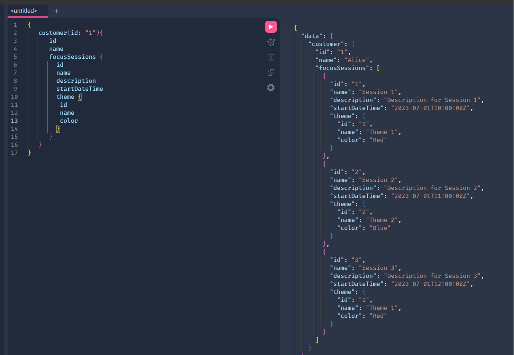

# Step 10 — Showing Customerm, FocusSession, and Theme Relationships (11 min)

Objective

- Implement resolvers so `Customer` returns related `FocusSessions`, and each `FocusSession` returns its related `Theme`.

Steps

1. Open `server/data/data.js` and add a `customerId` to each entry in `focusSessions`, matching it to one of the `id`s in `customers`. For example:

```js
focusSessions: [
  {
    id: "1",
    name: "Session 1",
    description: "Description for Session 1",
    notes: "Notes for Session 1",
    startDateTime: "2023-07-01T10:00:00Z",
    duration: 60,
    themeId: "1",
    customerId: "1",
  },
  {
    id: "2",
    name: "Session 2",
    description: "Description for Session 2",
    notes: "Notes for Session 2",
    startDateTime: "2023-07-01T11:00:00Z",
    duration: 90,
    themeId: "2",
    customerId: "1",
  },
  {
    id: "3",
    name: "Session 3",
    description: "Description for Session 3",
    notes: "Notes for Session 3",
    startDateTime: "2023-07-01T12:00:00Z",
    duration: 120,
    themeId: "1",
    customerId: "2",
  },
],
```

Each `focusSession` already has a `themeId` from Step 8 — spread the `customerId`s across a couple of different `customers` so you have more than one to test against (e.g. give Alice, `id: "1"`, more than one session).

2. In `FocusSessionType` define:

```js
    customer: { type: CustomerType,
        resolve(parent, args) {
            return _.find(customers, { id: parent.customerId });
        }
    }
```

3. In `FocusSessionType` define:

```js
theme: { type: ThemeType,
    resolve(parent, args) {
        return _.find(themes, { id: parent.themeId });
    }
},
```

Note this resolver returns a single `ThemeType`, not a list — many focus sessions can share the same theme, but each focus session has only one.

4. Add a focusSession collection to the customers, so we can see all the focus sessions a customer has had.

```js
focusSessions: {
  type: new GraphQLList(FocusSessionType),
  resolve(parent, args) {
    return _.filter(focusSessions, { customerId: parent.id });
  }
}
```

5. Ensure `focusSessions` and `themes` are imported from your `server/data/data.js` file.

6. Test nested queries in GraphiQL:

```graphql
{
  customer(id: "1") {
    id
    name
    focusSessions {
      id
      name
      theme {
        id
        name
        color
      }
    }
  }
}
```



What to check

- The customer query returns a nested `focusSessions` array, and each focus session returns its related `theme`.
