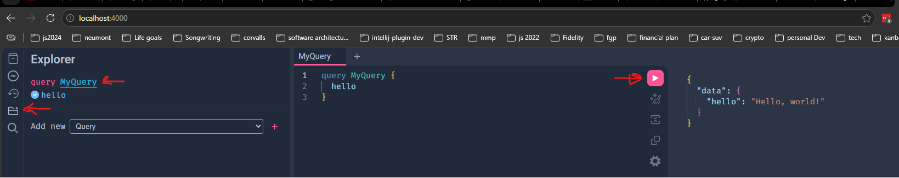
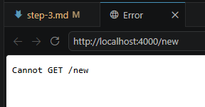
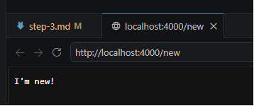

# Step 3 — Install GraphQL, GraphQL-HTTP, and ruru (10 min)

Objective

- Install GraphQL, GraphQL-HTTP and a GraphiQL-style UI (ruru)

GraphiQL is an in-browser tool for writing, validating, and
testing GraphQL queries. Ruru is a distribution of GraphiQL and related tooling to inspect your GraphQL API

Steps

1. Install packages:

```bash
$ npm install graphql graphql-http ruru

added 3 packages, and audited 70 packages in 2s

26 packages are looking for funding
  run `npm fund` for details

found 0 vulnerabilities
```

See those installed in package.json

```json
{
  "name": "graphql-project",
  "version": "1.0.0",
  "description": "A practice project for GraphQL",
  "main": "app.js",
  "scripts": {
    "test": "test"
  },
  "author": "Brent",
  "license": "ISC",
  "dependencies": {
    "express": "^5.2.1",
    "graphql": "^16.14.2",
    "graphql-http": "^1.22.4",
    "ruru": "^2.0.1"
  }
}
```

2. Add graphql-http to the `app.js`

```javascript
const express = require("express");
const graphqlHTTP = require("graphql-http").graphqlHTTP;

const app = express();

app.listen(4000, () => {
  console.log("Server is listening on port 4000");
});
```

3. Configure `graphiql`, 'pronounced graphical'

```javascript
const express = require("express");
const { createHandler } = require("graphql-http/lib/use/express");
const { ruruHTML } = require("ruru/server");
const { GraphQLSchema, GraphQLObjectType, GraphQLString } = require("graphql");

const app = express();

const schema = new GraphQLSchema({
  query: new GraphQLObjectType({
    name: "RootQueryType",
    fields: {
      hello: {
        type: GraphQLString,
        resolve: () => "Hello, world!",
      },
    },
  }),
});

app.all("/graphql", createHandler({ schema }));

app.get("/", (_req, res) => {
  res.type("html");
  res.end(ruruHTML({ endpoint: "/graphql" }));
});

app.listen(4000, () => {
  console.log("Server is listening on port 4000");
});

```

4. Run this right now to see the 'GraphiQL' display, and execute a simple query. Try it out! Stop and restart `node app`. Navigate in your browser to http://localhost:4000



Congratulations! You now have GraphQL, and a GraphiQL explorer. 

However, this is a pain to stop and restart. In the next steps we'll install **nodemon** so that we don't have to stop and restart anymore.

5. Install **nodemon** globally

```bash
$ npm install nodemon -g

added 28 packages in 2s
```

Now, when you change anything, it is immediately available. Try it out using the new `nodemon` instead

```bash
$ nodemon app
[nodemon] 3.1.14
[nodemon] to restart at any time, enter `rs`
[nodemon] watching path(s): *.*
[nodemon] watching extensions: js,mjs,cjs,json
[nodemon] starting `node app.js`
Server is listening on port 4000
[nodemon] clean exit - waiting for changes before restart
```

Hit the endpoint: http://localhost:4000/new



add the following the app.js

```javascript
app.get("/new", (_req, res) => {
  res.type("text");
  res.end("I'm new!");
});
```

now reload http://localhost:4000/new without restarting.



Now that you have GraphQL installed, with GraphiQL, and nodemon, you are ready to look at schemas!

