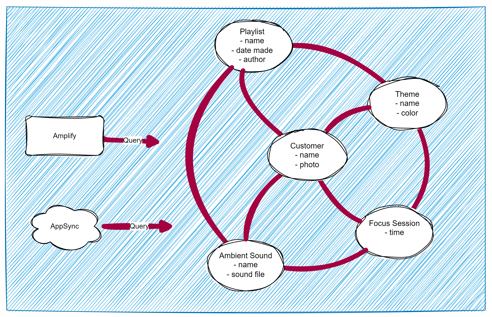

# Step 4 — Creating and Understanding Schemas (11 min)

Objective

- Create GraphQL types and the root schema file, explaining `GraphQLObjectType` and `GraphQLSchema`.

By now, we've set up a server, but there is no schema. If we think about some of the main domain entities from **FocusFlow**, we might talk about a Customer, Focus Session, Theme, Playlist and Ambient Sound. There are most certainly dozens more, but for now, let's stick to these.



We might consider the interactions to understand exactly how to, or what it is we need to query.

E.g. A **playlist** might have many **ambient sounds**, a **theme** has a **playlist**, a **customer** chooses a **theme** for their **focus session**, and **ambient sounds** from the **playlist** play during a **focus session**.

So a **schema** is a map of how the data is structured.

Up to now, we've just had a placeholder for the schema, but now we need to create the schema inside our project to represent these business domain entities into the server.

Steps

1. Create `server/graphql/schema.js` and add a basic `Customer` type and a `RootQuery` placeholder:

```js
const {
  GraphQLObjectType,
  GraphQLSchema,
  GraphQLString,
  GraphQLID,
} = require("graphql");

const CustomerType = new GraphQLObjectType({
  name: "Customer",
  fields: () => ({
    id: { type: GraphQLID },
    name: { type: GraphQLString },
    photo: { type: GraphQLString },
  }),
});

const RootQuery = new GraphQLObjectType({
  name: "RootQueryType",
  fields: () => ({}),
});

module.exports = new GraphQLSchema({ query: RootQuery });
```

In the next module, we'll check the GraphiQL interface to verify the new type!
