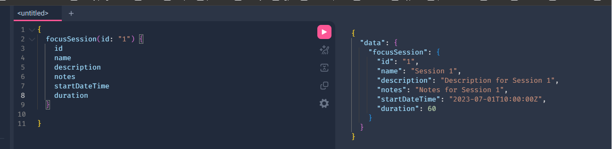

# Step 7 — Adding a FocusSession Type and RootQuery (8 min)

Objective

- Create a `FocusSession` type and add focus session queries to the schema.

Steps

1. In `server/graphql/schema.js` add `GraphQLInt` to the destructured `require("graphql")` import, then add a `FocusSessionType`:

```js
const FocusSessionType = new GraphQLObjectType({
  name: "FocusSession",
  fields: () => ({
    id: { type: GraphQLID },
    name: { type: GraphQLString },
    description: { type: GraphQLString },
    notes: { type: GraphQLString },
    startDateTime: { type: GraphQLString },
    duration: { type: GraphQLInt },
  }),
});
```

**Note:** You should notice that `GraphQLInt` needs to be imported. 

`startDateTime` is represented as an ISO 8601 string (e.g. `"2026-07-25T09:00:00Z"`) since GraphQL has no built-in date/time scalar. `duration` is the session length in minutes, so it's a `GraphQLInt`.

2. Add `focusSessions` to `RootQuery` and return `require('../data/sample').focusSessions`.

3. Add focusSessions data to the sample data (left to your imagination)

4. Test in GraphiQL:

```graphql
{
  focusSessions {
    id
    name
    startDateTime
    duration
  }
}
```



What to check

- `focusSessions` returns the sample focus session list defined in `server/data/data.js`.

