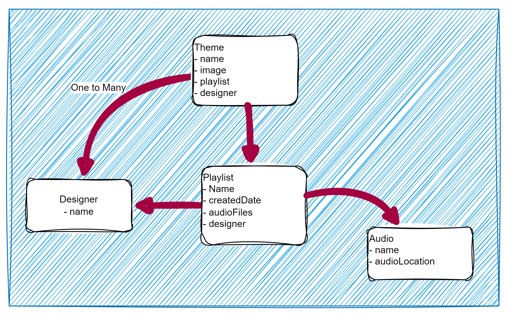

# Step 1 — App Overview (6 min)

## Objective

- Introduce the app we're building: a Next.js frontend for the `Designer`, `Theme`, and `Playlist` domain model, backed by AWS Amplify and AppSync.

## Outline

1. The domain model this lab builds on: a `Designer` owns `Theme`s and `Playlist`s, and each `Theme` can set a `Playlist`.

2. The `Designer` is: not a separate profile you create by hand, but the actual logged-in user, authenticated via Amazon Cognito. Every `Theme` and `Playlist` you create is automatically owned by whichever Cognito user is signed in when you create it.
3. What changes from the earlier labs: instead of an Express server you run and manage yourself, the GraphQL API is now hosted by **AWS AppSync**, its infrastructure (API, auth, resolvers) is defined as TypeScript and deployed with the **Amplify Gen 2** backend tooling (`ampx`), and real sign-up/sign-in is handled by **Amazon Cognito** rather than by hand.
4. What stays the same: it's still a GraphQL API modeling `Theme` and `Playlist` data — you're changing how the API is hosted, secured, and deployed, not the core shape of that data.

**Note:** the pieces you'll be assembling over the rest of this lab: the Next.js frontend ([Step 2](./step-2.md)–[Step 4](./step-4.md)), the Amplify-managed AppSync backend with Cognito auth ([Step 5](./step-5.md)–[Step 7](./step-7.md)), and the login-gated GraphQL query that connects them ([Step 8](./step-8.md)).

