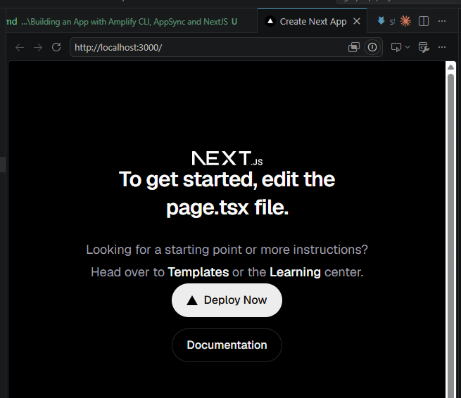
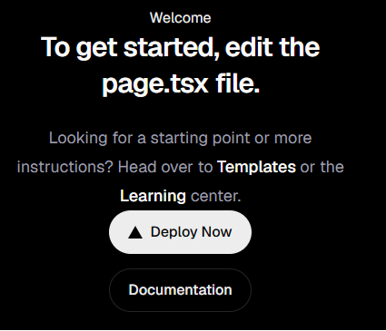

# Step 2 — Creating the NextJS App (2 min)

## Objective

- Scaffold a new Next.js application as the frontend for this lab.

Note: this is not a NextJS class

## Steps

1. From the repo root, scaffold the app into the existing `amplify-app/` directory:

```bash
npx create-next-app@latest amplify-app
```

2. When prompted "Would you like to use the recommended Next.js defaults?", choose:
   - Yes, use recommended defaults - TypeScript, ESLint, No React Compiler, Tailwind CSS, No src/ directory, App Router, AGENTS.md
   
After 1 minutes, you should see `Success! Created amplify-app at <your project dir>\amplify-app`

3. Move into the new project and start the dev server:

```bash
cd amplify-app
npm run dev
```


4. Open `http://localhost:3000` and confirm the default Next.js starter page loads.

## What to check

- `amplify-app/` contains a `package.json`, an `app/` directory, and `next.config.js`.
- `npm run dev` starts without errors and the starter page renders at `http://localhost:3000`.

## Challenge

Update the placeholder NextJS image content in `app/page.tsx` down to a single `<h1>` with the words `Welcome`, and confirm it still renders. Then proceed to [Step 3](./step-3.md).

