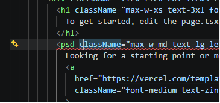
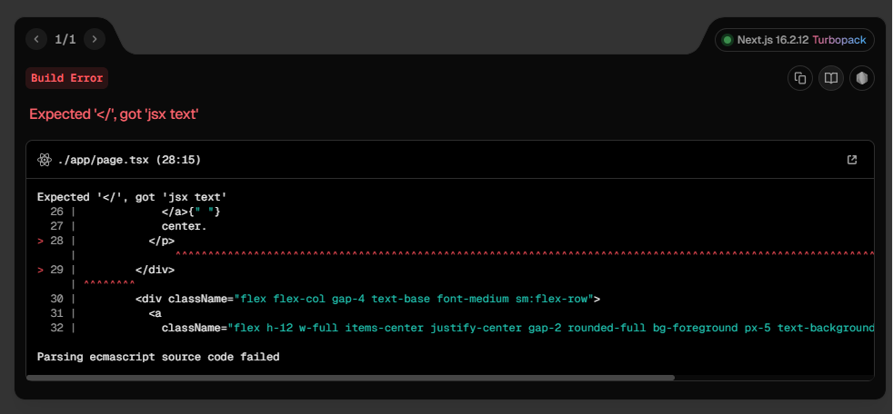

# Step 3 — NextJS Hot Reload (2 min)

## Objective

- Confirm Next.js's dev server hot-reloads the app on file changes.

## Steps

1. With `npm run dev` still running from Step 2, open `amplify-app/app/page.tsx` in your editor.
2. Change the text inside the returned tsx (e.g. the `<h1>`) to something new and save the file.
3. Switch back to the browser tab at `http://localhost:3000` without refreshing, and watch the page update in place.
4. Introduce a syntax error on purpose (e.g. delete a closing tag) and confirm Next.js shows an overlay with the error instead of silently failing.

5. Fix the error and confirm the overlay clears and hot reload resumes.

## What to check

- Editing and saving `page.tsx` updates the browser automatically, with no manual refresh.
- A syntax error surfaces as an in-browser overlay with a useful message.

