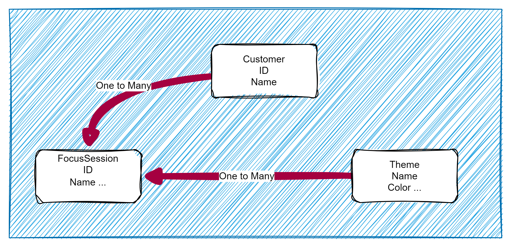
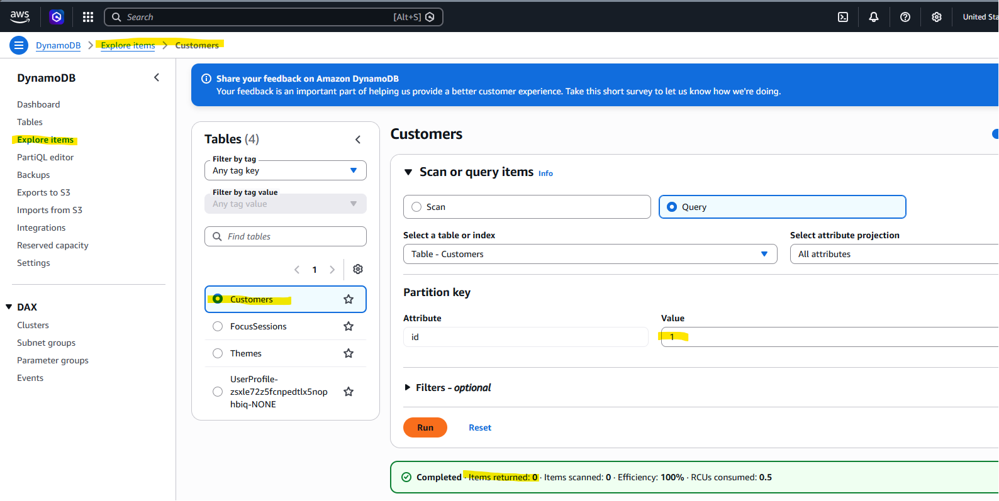

# Step 5 — Create Theme and FocusSession Tables (3 min)

## Objective

- Define the `Themes` table, and the `FocusSessions` table with a GSI for looking up sessions by `customerId`.

Remember our model?



We're going to be creating these tables with a GSI (Global Secondary Index) for lookups

## Steps

1. In `server/db/createTables.js`, add the `THEMES_TABLE` and `FOCUS_SESSIONS_TABLE` names to the import from Step 4's `tableNames.js`:

```js
const { CUSTOMERS_TABLE, THEMES_TABLE, FOCUS_SESSIONS_TABLE } = require("./tableNames");
```

2. Add a `Themes` table using `id` (String) as the partition key — `Theme` is standalone in this domain (created independently, then referenced by a `FocusSession`), so it doesn't need an owner reference or GSI:

```js
client
  .send(
    new CreateTableCommand({
      TableName: THEMES_TABLE,
      AttributeDefinitions: [{ AttributeName: "id", AttributeType: "S" }],
      KeySchema: [{ AttributeName: "id", KeyType: "HASH" }],
      BillingMode: "PAY_PER_REQUEST",
    })
  )
  .then(() => console.log(`${THEMES_TABLE} table created`))
  .catch((err) => console.error("Failed to create table:", err));
```

3. Add a `FocusSessions` table using `id` (String) as the partition key, plus a `customerId-index` **Global Secondary Index** so you can query "all focus sessions for this customer" — the same lookup the `focusSessions(customerId)` query from the Getting Started lab performs. Its `themeId` attribute doesn't need its own GSI, since a `FocusSession` only ever needs its *one* theme, looked up directly by primary key in Step 8:

```js
client
  .send(
    new CreateTableCommand({
      TableName: FOCUS_SESSIONS_TABLE,
      AttributeDefinitions: [
        { AttributeName: "id", AttributeType: "S" },
        { AttributeName: "customerId", AttributeType: "S" },
      ],
      KeySchema: [{ AttributeName: "id", KeyType: "HASH" }],
      GlobalSecondaryIndexes: [
        {
          IndexName: "customerId-index",
          KeySchema: [{ AttributeName: "customerId", KeyType: "HASH" }],
          Projection: { ProjectionType: "ALL" },
        },
      ],
      BillingMode: "PAY_PER_REQUEST",
    })
  )
  .then(() => console.log(`${FOCUS_SESSIONS_TABLE} table created`))
  .catch((err) => console.error("Failed to create table:", err));
```

4. Run the script again (`node .\db\createTables.js`) and confirm both new tables in the DynamoDB console.

## What to check

- The `Themes` table shows `ACTIVE` status with `id` as its primary partition key.
- The `FocusSessions` table shows `ACTIVE` status with `id` as its primary partition key, and its `customerId-index` GSI shows `ACTIVE` with `customerId` as its partition key.

## Challenge

Try running a manual `QueryCommand` against the `customerId-index` directly in the console's "Explore table items" view (with a made-up `customerId`) to confirm the index is queryable, then proceed to [Step 6](./step-6.md).

