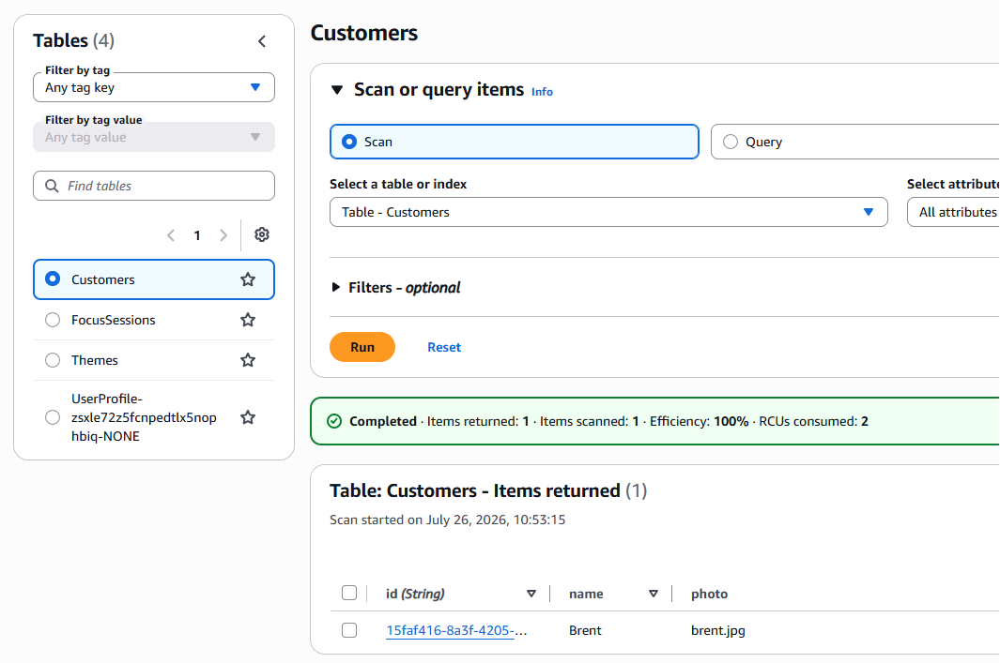

# Step 6 — Save a Customer & a FocusSession (14 min)

## Objective

- Add mutations that write a `Customer` and a `FocusSession` item to DynamoDB.

## Steps

1. In `server/graphql/schema/schema.js`, add the new requires alongside the existing ones — the DynamoDB document client from Step 3, `PutCommand` from `@aws-sdk/lib-dynamodb`, `uuidv4` from `uuid`, and the table name constants from Step 4:

```js
const { PutCommand } = require("@aws-sdk/lib-dynamodb");
const { v4: uuidv4 } = require("uuid");
const docClient = require("../../db/dynamo");
const { CUSTOMERS_TABLE, FOCUS_SESSIONS_TABLE } = require("../../db/tableNames");
```

2. Replace `createCustomer`'s `resolve` so it builds an item with a generated `id`, writes it with `PutCommand`, and returns it — note `resolve` is now `async` since sending a command is a `Promise`, and `PutCommand` doesn't hand the item back to you the way pushing to the in-memory `customers` array did:

```js
createCustomer: {
  type: CustomerType,
  args: {
    name: { type: new GraphQLNonNull(GraphQLString) },
    photo: { type: GraphQLString },
  },
  async resolve(parent, args) {
    const customer = {
      id: uuidv4(),
      name: args.name,
      photo: args.photo,
    };
    await docClient.send(new PutCommand({ TableName: CUSTOMERS_TABLE, Item: customer }));
    return customer;
  },
},
```

Test this in your Ruru console:

```graphql
mutation {
  createCustomer(name: "Brent",photo: "brent.jpg"){
    id
    name
    photo
    
  }
}
output...
{
  "data": {
    "createCustomer": {
      "id": "15faf416-8a3f-4205-ae5c-3c41450505d8",
      "name": "Brent",
      "photo": "brent.jpg"
    }
  }
}
```

check your aws console:



3. Replace `createFocusSession`'s `resolve` the same way, writing into `FocusSessions`:

```js
createFocusSession: {
  type: FocusSessionType,
  args: {
    name: { type: new GraphQLNonNull(GraphQLString) },
    description: { type: GraphQLString },
    notes: { type: GraphQLString },
    startDateTime: { type: new GraphQLNonNull(GraphQLString) },
    duration: { type: GraphQLInt },
    themeId: { type: GraphQLID },
    customerId: { type: new GraphQLNonNull(GraphQLID) },
  },
  async resolve(parent, args) {
    const focusSession = {
      id: uuidv4(),
      name: args.name,
      description: args.description,
      notes: args.notes,
      startDateTime: args.startDateTime,
      duration: args.duration,
      themeId: args.themeId,
      customerId: args.customerId,
    };
    await docClient.send(new PutCommand({ TableName: FOCUS_SESSIONS_TABLE, Item: focusSession }));
    return focusSession;
  },
},
```

4. Test both mutations in GraphiQL, using the `id` from the created `Customer` as the `customerId` for the `FocusSession`:

```graphql
mutation {
  createCustomer(name: "Ada Lovelace") {
    id
    name
  }
}
```

```graphql
mutation {
  createFocusSession(
    name: "Morning Deep Work"
    startDateTime: "2026-07-26T09:00:00Z"
    duration: 45
    customerId: "<id from createCustomer above>"
  ) {
    id
    name
  }
}
```

Notes:
- `FocusSessionType` doesn't expose a raw `customerId` field — only the resolved `customer`/`theme` fields — so you can't select `customerId` directly in the response. Confirm the reference saved correctly by checking the item in the DynamoDB console instead.
- Don't query the nested `customer`/`theme` fields yet, either — those resolvers still read from the old in-memory `data.js` arrays and won't find the new DynamoDB item until Step 8 rewires them.

What to check

- `createCustomer` returns the item you built, including its generated `id`.
- `createFocusSession` returns an item referencing the `customerId` you passed in.
- The new items are visible under "Explore table items" in the DynamoDB console for `Customers` and `FocusSessions`.

Challenge

Try creating a second `Customer` and a `FocusSession` that references it, to confirm multiple items save correctly, then proceed to [Step 7](./step-7.md).
