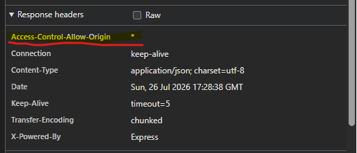

# Step 9 — CORS and Adding NonNulls to Required Fields (7 min)

## Objective

- Enable CORS on the Express app and mark required mutation arguments with `GraphQLNonNull`.

**CORS**

Browsers enforce the **same-origin policy**: JavaScript running on one origin (e.g. a React app on `http://localhost:3000`) is blocked by default from reading responses from a different origin (e.g. this API on `http://localhost:4000`) — even though a plain `curl` request works fine, since that policy is enforced by the browser, not the server. **CORS (Cross-Origin Resource Sharing)** is the mechanism a server uses to opt back in: it adds response headers (like `Access-Control-Allow-Origin`) telling the browser "requests from this origin are allowed." Without those headers, GraphiQL and `curl` will keep working (they aren't bound by browser rules), but a real frontend app on a different origin will have its requests silently blocked by the browser. The `cors` package below just adds that header automatically on every response.

## Steps

1. Install `cors` in `server/`:

```bash
npm install cors
```

2. In `server/app.js`, require it and register it before the GraphQL middleware, so a browser-based client on a different origin can call the API:

```js
const cors = require("cors");
// ...
app.use(cors());
app.all("/graphql", createHandler({ schema }));
```

3. Review each mutation's args in `server/graphql/schema/schema.js` and confirm which ones are truly required — `createCustomer` (`name`), `createFocusSession` (`name`, `startDateTime`, `customerId`), and `createTheme` (`name`) already wrap those in `GraphQLNonNull`, matching the pattern from the Mutations lab. Leave the rest (`photo`, `description`, `notes`, `duration`, `themeId`) optional.
4. Re-test each mutation in GraphiQL, both with all required fields present and with one omitted, to confirm GraphQL now rejects incomplete requests before the resolver runs — e.g. omitting `name` from `createCustomer` should return a validation error instead of writing a nameless item to DynamoDB.

## What to check

- A request from a different origin (or GraphiQL's network tab) shows the CORS headers are present.

- Omitting a required argument now returns a GraphQL validation error instead of reaching the resolver.
- Existing valid mutations from earlier steps still succeed unchanged.

