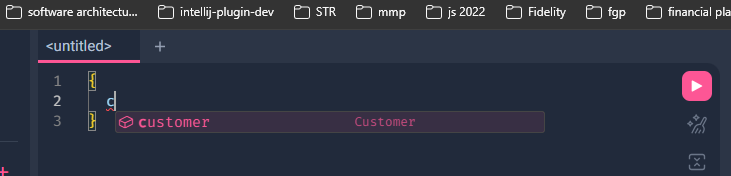
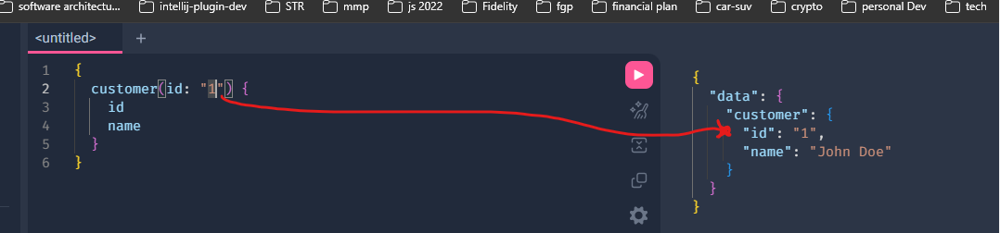

# Step 5 — The RootQuery and Running Queries on GraphQL (16 min)

Objective

- Implement `RootQuery` fields and enable GraphiQL to run queries.


Steps

1. Update `server/graphql/schema.js` to export `RootQuery` fields (example `customer` and `customers`):

The **RootQuery** is very important, so that we can then start type graphQL commands so that the server knows how to serve the data that we need.

So now add the following to the bottom of `schema.js`:
```js

const RootQuery = new GraphQLObjectType({
  name: "RootQueryType",
  fields: {
    customer: {
      type: CustomerType,
      args: { id: { type: GraphQLString } },

      resolve(parent, args) {
        // Here you would typically fetch data from a database or another source
        // For demonstration purposes, we'll return a static customer object
        return {
          id: args.id,
          name: "John Doe",
          photo: "photo.jpg",
        };
      },
    },
  },
});

module.exports = new GraphQLSchema({ query: RootQuery });
```

The **RootQuery** is the entry point for every read query your API supports. Each field you define on it (like `customer` above) becomes something a client can ask for directly, e.g. `{ customer(id: "1") { name } }`. Think of it as the "menu" of top-level queries GraphQL exposes — anything not listed here can't be queried from the root.

Each field also has a **resolve** function, or **resolver**. GraphQL doesn't know how to get your data on its own — the resolver is the code that actually produces it for that field. It receives four arguments:

- `parent` — the result returned by the parent field's resolver (unused at the root, but important once you resolve nested fields like `customer.posts`).
- `args` — the arguments passed in the query, e.g. `id` from `customer(id: "1")`.
- `context` — shared data available to every resolver in a request (auth info, a database connection, etc.).
- `info` — metadata about the query itself (rarely needed for basic resolvers).

Here, the `customer` field's resolver ignores `parent`/`context`/`info` and just returns a static object using `args.id`. Later, you'll swap that static return for a real lookup against `server/data/data.js`.

2. Add this schema back to app.js

```javascript
const express = require("express");
const { createHandler } = require("graphql-http/lib/use/express");
const { ruruHTML } = require("ruru/server");
const { GraphQLSchema, GraphQLObjectType, GraphQLString } = require("graphql");
const schema = require("./graphql/schema/schema");

const app = express();

app.all("/graphql", createHandler({ schema }));

// make this run off of ruru

app.get("/", (_req, res) => {
  res.type("html");
  res.end(ruruHTML({ endpoint: "/graphql" }));
});


app.listen(4000, () => {
  console.log("Server is listening on port 4000");
});
```

3. If `nodemon` is still running, open `http://localhost:4000` to use GraphiQL.

Run sample queries like:

```graphql
{
  customers {
    id
    name
    photo
  }
}
```

**Note:** GraphiQL has the documentation provided, and you can see hints about what is available:



Finish typing it in, and run the query.



See a result like:
```json
{
  "data": {
    "customer": {
      "id": null,
      "name": "John Doe",
      "photo": "photo.jpg"
    }
  }
}
```

